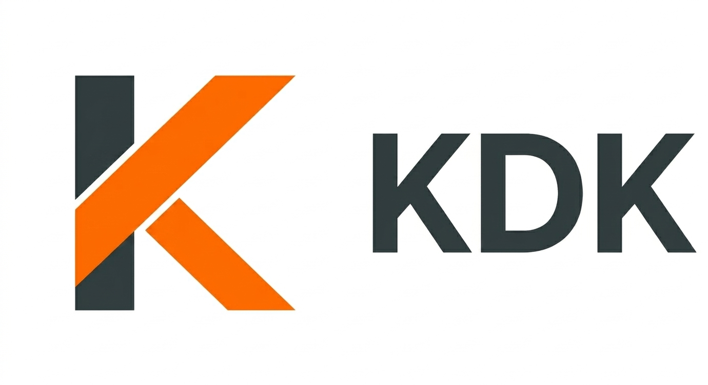

# KDK

<div>
  
  <p><i>Lambda inverted just to fit with letter K</i></p>
</div>

A WIP development kit in Rust for microcontroller bitcoin wallet signers
(mainly aimed to ESP32 or STM32) based on [selfcustody/krux](https://github.com/selfcustody/krux),
for support microcontroller hardware signers with rust.

## Motivation

The motivation came from a past discussion that maybe could not be accesible
based on past [maybe could not be available for public](https://github.com/selfcustody/krux/discussions/189):

```
Should a hardware device support signing Nostr events? Definitely.

Should Krux? I think it could make sense (if you view Krux as firmware for
hardware signing _in general_), but not in its current form due to all the
Bitcoin-specific assumptions being made about wallets, receive addresses, PSBTs,
etc.

The way I see it, there are 3 options:

1) Add support for Nostr in the existing UI, but wrap a bunch of places in
`if is_nostr()` style checks to hide or show certain UI elements (e.g.,
`Scan Address`, `Wallet`, `Sign PSBT`, etc. don't make sense to show if using
a Nostr key, and `Show Nostr public key`, `Sign Nostr event` don't make sense
if using a Bitcoin key)
2) Fork Krux, rip out the Bitcoin stuff entirely, and focus the fork on being
exclusively a Nostr signer
3) Don't fork Krux, but redesign it such that it can support different use cases
or cryptocurrencies / elliptic curves.

Option 1, while it could work and is the "easiest" to do, would make the code
harder to follow and maintain and begin to split Krux's focus. Not a fan of
shoehorning it in like this.

Option 2 is a good short-term solution if people want something that works
right now @odudex. Since my activity has dropped off the past few months,
option 3 (my preference, see below) may take longer than desired to come to
fruition; so I would be fine with a dedicated fork of Krux that focuses
exclusively on Nostr if you want to take that up. (Of course, it's FOSS,
so you can do what you want. Just giving my blessing :))

Option 3 is my long-term preference. I think there is a way we could eventually
redesign Krux so that other users could write plugins for their preferred "crypto"
(crypto in quotes since it could be a currency or something else entirely like
Nostr) to customize the experience as needed for each one. The way I'm thinking
it could be done would be similar to Ledger where the community can create their
own "apps," only in this case the app would be in its own repo and would be
selected + built into the firmware by the user. The existing Bitcoin "app"
would be the default and is what I would continue to publish and sign as the
official Krux release, but others could publish and sign the versions of Krux
where the app is something else like Nostr, Ethereum, etc.

What do others think?
```

> *Jeff Sun*, Krux's creator

### Disclaimer

In any way KDK wants to compete with [Kern](https://github.com/odudex/kern) or
[Krux](https://github.com/selfcustody/krux), neither to redesign some basic
aspects of krux, almost following a mix of `Option 1` and `Option 3`:

- keep based-bitcoin firwamre
- `master` branch could accept `bitcoin-related` PRs as **features**, except
altcoins (i.e., `nostr`, `liquid`, `pgp`, `crypto-primitives` could be accepted
depending o context and review) -- they could share `traits`, `enums`, `structs`
and `methods` with different parameters (e.g: `nostr` and `schnoor`)
 
> **⚠️ Experimental.** This software has not been audited. Do not use it
> with real funds. See [`SECURITY.md`](SECURITY.md).

## Quick start

### Rust unit tests

```bash
cargo test
```

### Examples

To see sample examples:

```bash
cargo run --example <example_name> # on crates/kdk-*/examples
```

## License

[MIT](LICENSE) — see `LICENSE`.
